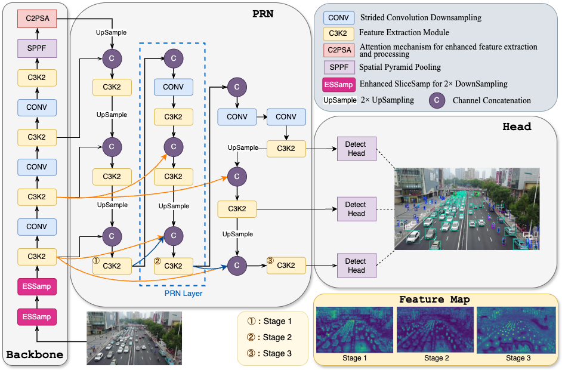

# PRNet
Detecting small objects in aerial images remains a significant challenge in computer vision. This difficulty primarily arises from the small size of targets and complex backgrounds, leading to critical information loss during feature extraction, which severely limits detection performance. While existing methods predominantly employ post-processing enhancement strategies to compensate for lost detail information, they struggle to address the core issue of information degradation at its source. For targets with severely limited pixel representation, we contend that maximizing high-resolution detail retention from the initial processing stages is critical for performance gains. To this end, we propose PRNet, a novel detection framework designed to preserve original high-resolution information through two key innovations: (1) A Progressive Refinement Neck (PRN) that iteratively enhances spatial details via multi-stage backbone feature reuse, and (2) An Enhanced SliceSamp (ESSamp) module that minimizes detail degradation during downsampling through optimized spatial rearrangement and depthwise convolution operations. Extensive experiments on the VisDrone and AI-TOD datasets demonstrate that PRNet consistently outperforms state-of-the-art methods under equivalent computational constraints, achieving an optimal accuracy-efficiency balance. These results validate the effectiveness of our architecture-first approach to information preservation, providing a new solution for efficient small object detection.

Please follow the YOLO11 installation instructions.

train CLI:
yolo detect train model=yolo11s-PRNet.yaml data=VisDrone.yaml epochs=350 pretrained=False batch=16 patience=50 device=0

val:

Checkpoints:
We provide the following checkpoints:
