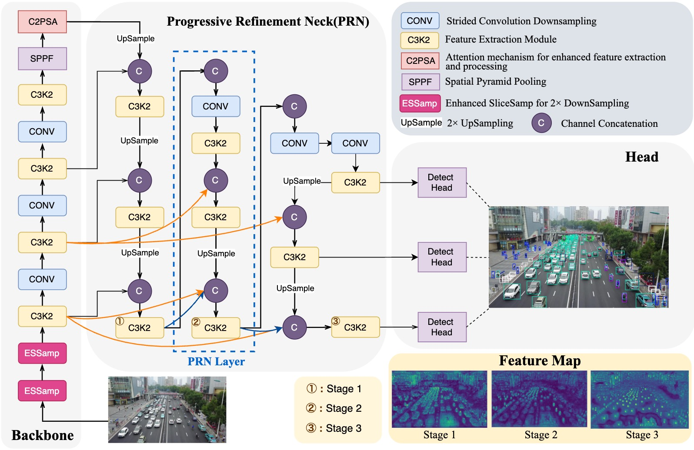

# PRNet
Small object detection in aerial images suffers from severe information degradation during feature extraction due to limited pixel representations, where shallow spatial details fail to align effectively with semantic information, leading to frequent misses and false positives. Existing FPN-based methods attempt to mitigate these losses through post-processing enhancements, but the reconstructed details often deviate from the original image information, impeding their fusion with semantic content. To address this limitation, we propose PRNet, a real-time detection framework that prioritizes the preservation and efficient utilization of primitive shallow spatial features to enhance small object representations. PRNet achieves this via two modules:the Progressive Refinement Neck (PRN) for spatial-semantic alignment through backbone reuse and iterative refinement, and the Enhanced SliceSamp (ESSamp) for preserving shallow information during downsampling via optimized rearrangement and convolution. Extensive experiments on the VisDrone, AI-TOD, and UAVDT datasets demonstrate that PRNet outperforms state-of-the-art methods under comparable computational constraints, achieving superior accuracy-efficiency trade-offs.



installation:
cd PRNet/
pip install -e .

PRNet train CLI:
yolo detect train model=yolo11s-PRNet.yaml data=VisDrone.yaml epochs=350 pretrained=False batch=8 patience=50 device=0

PRNet-L train CLI:
yolo detect train model=yolo11l-PRNet.yaml data=VisDrone.yaml epochs=350 pretrained=False batch=8 patience=50 device=0

val:
yolo detect val model=PRNet.engine data=VisDrone.yaml device=0 split=val

Checkpoints:
We provide the following checkpoints: [PRNet](https://pan.baidu.com/s/1h6Eq34VsH_5k-Bg5ixeRuA?pwd=447t)

# PRNet: Progressive Refinement Network for Small Object Detection


## 📋 Overview

Small object detection in aerial images suffers from severe information degradation during feature extraction due to limited pixel representations, where shallow spatial details fail to align effectively with semantic information, leading to frequent misses and false positives. Existing FPN-based methods attempt to mitigate these losses through post-processing enhancements, but the reconstructed details often deviate from the original image information, impeding their fusion with semantic content. To address this limitation, we propose PRNet, a real-time detection framework that prioritizes the preservation and efficient utilization of primitive shallow spatial features to enhance small object representations. PRNet achieves this via two modules:the Progressive Refinement Neck (PRN) for spatial-semantic alignment through backbone reuse and iterative refinement, and the Enhanced SliceSamp (ESSamp) for preserving shallow information during downsampling via optimized rearrangement and convolution. Extensive experiments on the VisDrone, AI-TOD, and UAVDT datasets demonstrate that PRNet outperforms state-of-the-art methods under comparable computational constraints, achieving superior accuracy-efficiency trade-offs.

## 📦 Installation

```bash
cd PRNet/
python -m venv PRNet
source PRNet/bin/activate
pip install -e .
```

## 🏋️ Training

### PRNet Standard Model
```bash
yolo detect train model=yolo11s-PRNet.yaml data=VisDrone.yaml epochs=350 pretrained=False batch=8 patience=50 device=0
```

### PRNet-L Large Model
```bash
yolo detect train model=yolo11l-PRNet.yaml data=VisDrone.yaml epochs=350 pretrained=False batch=8 patience=50 device=0
```

## 🔍 Validation

```bash
yolo detect val model=PRNet.engine data=VisDrone.yaml device=0 split=val
```

## 📥 Checkpoints

We provide pre-trained model checkpoints for easy deployment:

🔗 **[Download PRNet Checkpoints](https://pan.baidu.com/s/1h6Eq34VsH_5k-Bg5ixeRuA?pwd=447t)**


## 📝 Citation

If you find PRNet useful in your research, please consider citing our work:


